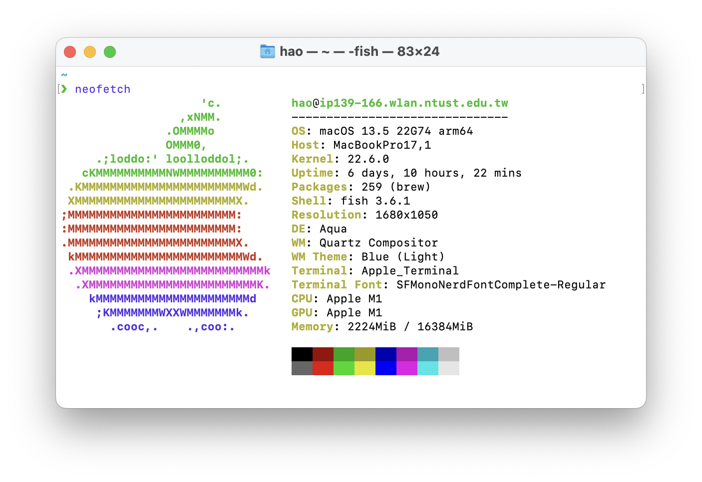

# CS2022301-Exact-Boolean-Minimization

> 資訊工程系 二年級 乙班 張皓鈞 B11030202


## Requirements

- GNU GCC/Clang with C++14 supported
- CMake >= 3.18

> Visual C++ may be supported, but not tested


## Build

```bash
mkdir build
cd build
cmake -DCMake_BUILD_TYPE=Release ..
cmake --build .
```


## Test platform



### macOS

```
Darwin ip139-166.wlan.ntust.edu.tw 22.6.0 Darwin Kernel Version 22.6.0: Wed Jul  5 22:22:52 PDT 2023; root:xnu-8796.141.3~6/RELEASE_ARM64_T8103 arm64
```

### Apple Clang

```
Apple clang version 15.0.0 (clang-1500.0.40.1)
Target: arm64-apple-darwin22.6.0
Thread model: posix
InstalledDir: /Applications/Xcode.app/Contents/Developer/Toolchains/XcodeDefault.xctoolchain/usr/bin
```

### CMake

```
cmake version 3.26.4
```


## Test Cases

### Case 1

[./examples/set03/case1.pla](./examples/set03/case1.pla)

#### Input PLA

```pla
.i 4
.o 1
.ilb a b c d
.ob f
.p 8
0000 -
001- 1
01-- 1
10-- 1
110- 1
111- 1
-000 1
1111 -
.e
```

#### Output PLA

```pla
.i 4
.o 1
.ilb a b c d 
.ob f 
.p 3
--1- 1
-1-- 1
1--- 1
.e
```

#### Best solutions

- $f = c + b + a$


### Case 2

[./examples/set03/case2.pla](./examples/set03/case2.pla)

#### Input PLA

```pla
.i 5
.o 1
.ilb a b c d e
.ob f
.p 5
-1101 1
01--1 1
-0011 1
11100 -
---11 1
.e
```

#### Output PLA

```pla
.i 5
.o 1
.ilb a b c d e 
.ob f 
.p 3
01--1 1
---11 1
1110- 1
.e
```

#### Best solutions

- $f = a'be + de + abcd'$

- $f = a'be + de + bce$


#### Case 3

#### Input PLA

```pla
.i 6
.o 1
.ilb a b c d e g
.ob f
.p 16
0000100 1
0001000 1
0--1011 1
0010101 1
0001101 -
0011-01 1
0011010 1
0011101 1
010-111 1
01011-1 1
0110101 1
0111001 -
01011-1 1
0110111 1
0111011 1
0111101 1
.e
```

#### Output PLA

```pla
.i 6
.o 1
.ilb a b c d e g 
.ob f 
.p 6
00--10 1
00-10- 1
0--101 1
0--110 1
010-11 1
01101- 1
.e
```

#### Best solutions

- $f = a'b'eg' + a'b'de' + a'de'g + a'deg' + a'bc'eg + a'bcd'e$

- $f = a'b'eg' + a'b'de' + a'de'g + a'ceg' + a'bd'eg + a'bc'de$

- $f = a'b'eg' + a'b'dg' + a'de'g + a'deg' + a'bc'eg + a'bcd'e$
  
- $f = a'b'eg' + a'b'dg' + a'de'g + a'ceg' + a'bd'eg + a'bc'de$

